# Home-Lab
# SOC Homelab - Detecting & Blocking an Active Directory Brute-Force Attack

A self-hosted blue team lab built to practice the full detection lifecycle: segmenting a network, joining clients to Active Directory, standing up an IDS/IPS, simulating a real attack chain from a red team box, and catching/blocking it with SIEM correlation and inline IPS rules.

**Stack:** pfSense (firewall + Suricata IPS) · Active Directory Domain Services · Splunk Enterprise (SIEM) · Snort IDS · Kali Linux (red team) · VMware Workstation

---

## Architecture

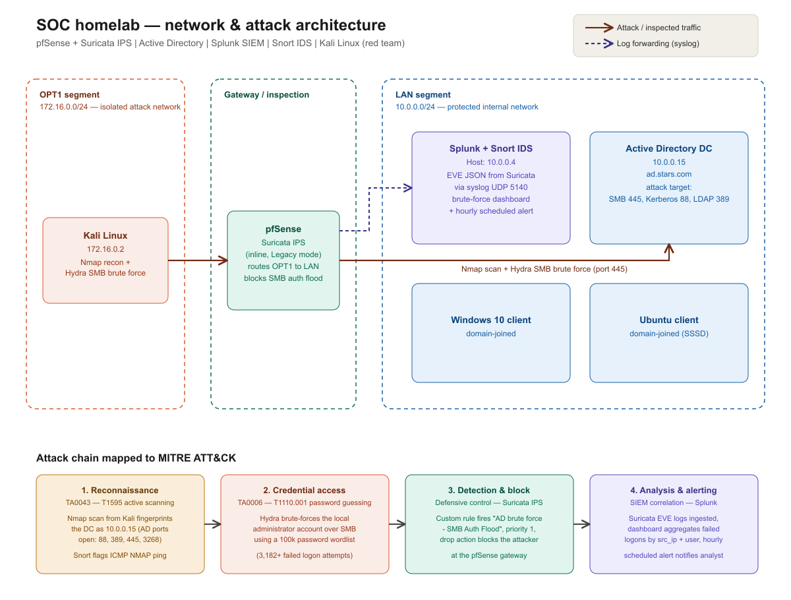

The lab is split into three segments behind pfSense:

| Segment | Subnet | Purpose |
|---|---|---|
| **OPT1** | `172.16.0.0/24` | Isolated attack network - Kali Linux only |
| **Gateway / inspection** | - | pfSense + Suricata IPS, routes OPT1 ↔ LAN, blocks malicious traffic inline |
| **LAN** | `10.0.0.0/24` | Protected internal network - Domain Controller, Splunk + Snort, domain-joined Windows 10 and Ubuntu clients |

This mirrors a real enterprise pattern: an untrusted zone, a gateway that inspects and filters traffic between zones, and a protected internal network where the actual assets live.

---

## Lab Components

| Host | IP | Role |
|---|---|---|
| pfSense | `10.0.0.1` (LAN) / `172.16.0.1` (OPT1) | Firewall, routing, inline Suricata IPS |
| Active Directory DC | `10.0.0.15` | Domain controller, `ad.stars.com` |
| Splunk + Snort | `10.0.0.4` | SIEM (log aggregation, correlation, alerting) + passive Snort IDS |
| Windows 10 client | `10.0.0.3` | Domain-joined endpoint, Sysmon + Splunk Universal Forwarder |
| Ubuntu client | `10.0.0.5` | Domain-joined via SSSD |
| Kali Linux | `172.16.0.2` | Red team box - recon and brute-force source |

---

## 1. Building the network and joining the domain

pfSense was built with three interfaces — WAN, LAN, and OPT1 - to keep the simulated attacker fully isolated from the protected network until traffic is explicitly routed and inspected.

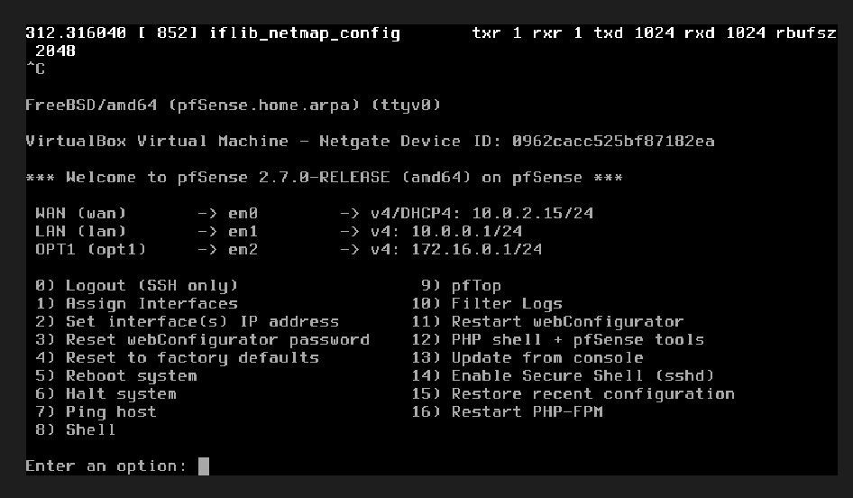

Per-host firewall rules on the LAN interface scope what each box on the internal network is allowed to do, rather than leaving a flat allow-all LAN:

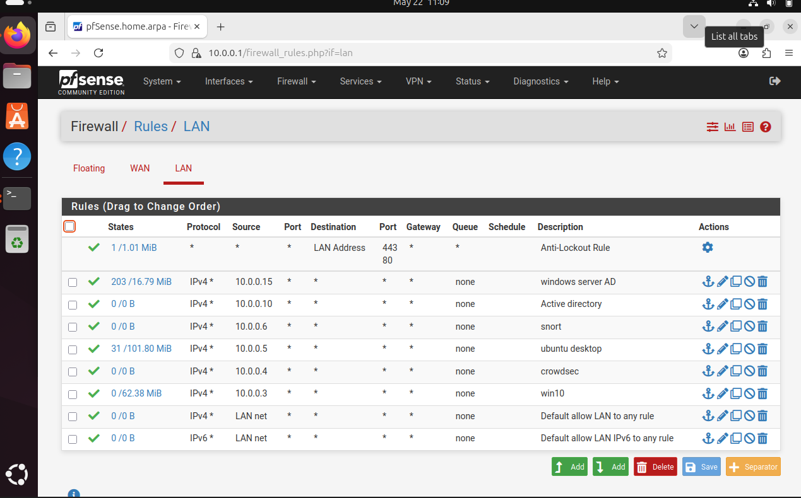

The Ubuntu client was given a static IP via Netplan and pointed at the domain controller for DNS so it could resolve the AD domain and join it over Kerberos:

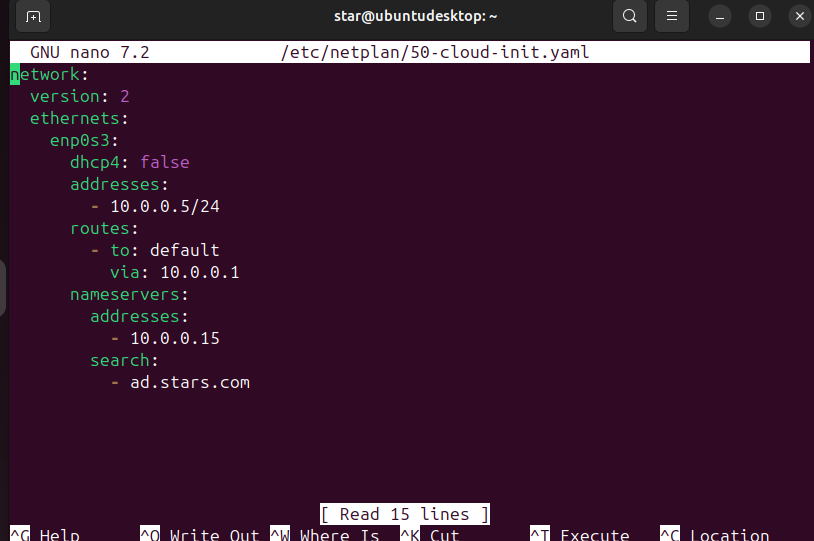

```yaml
network:
  version: 2
  ethernets:
    enp0s3:
      dhcp4: false
      addresses:
        - 10.0.0.5/24
      routes:
        - to: default
          via: 10.0.0.1
      nameservers:
        addresses:
          - 10.0.0.15
        search:
          - ad.stars.com
```

Both client types were joined to the `ad.stars.com` domain and organized into OUs by platform (`stars/linux`, `stars/windows`) for cleaner policy management:

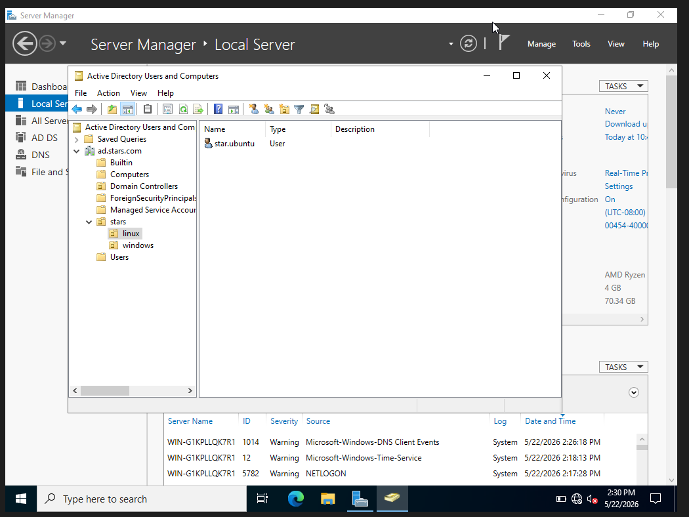

Domain authentication was verified end-to-end with Kerberos directly from the Ubuntu client, including walking through the forced password change on first login:

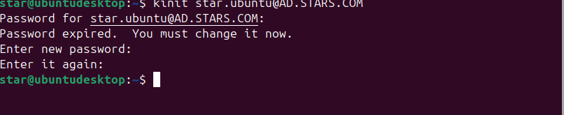

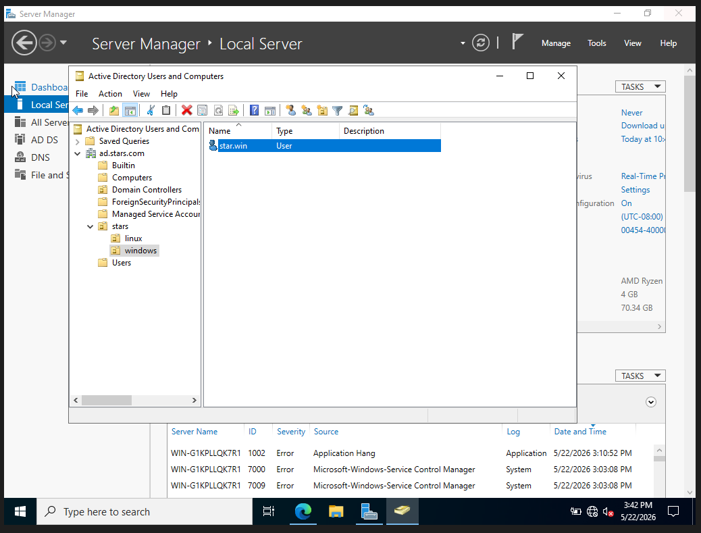

---

## 2. Detection engineering

Before simulating any attack, detection logic was written and the telemetry pipeline was wired up first - so nothing would go undetected once the red team started.

**Snort** was deployed as a passive IDS to flag reconnaissance and common web/auth attack patterns, with a small set of custom signatures:

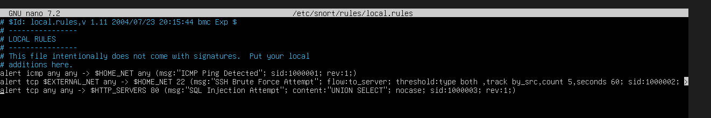

```
alert icmp any any -> $HOME_NET any (msg:"ICMP Ping Detected"; sid:1000001; rev:1;)
alert tcp $EXTERNAL_NET any -> $HOME_NET 22 (msg:"SSH Brute Force Attempt"; flow:to_server; threshold:type both, track by_src, count 5, seconds 60; sid:1000002; rev:1;)
alert tcp any any -> $HTTP_SERVERS 80 (msg:"SQL Injection Attempt"; content:"UNION SELECT"; nocase; sid:1000003; rev:1;)
```

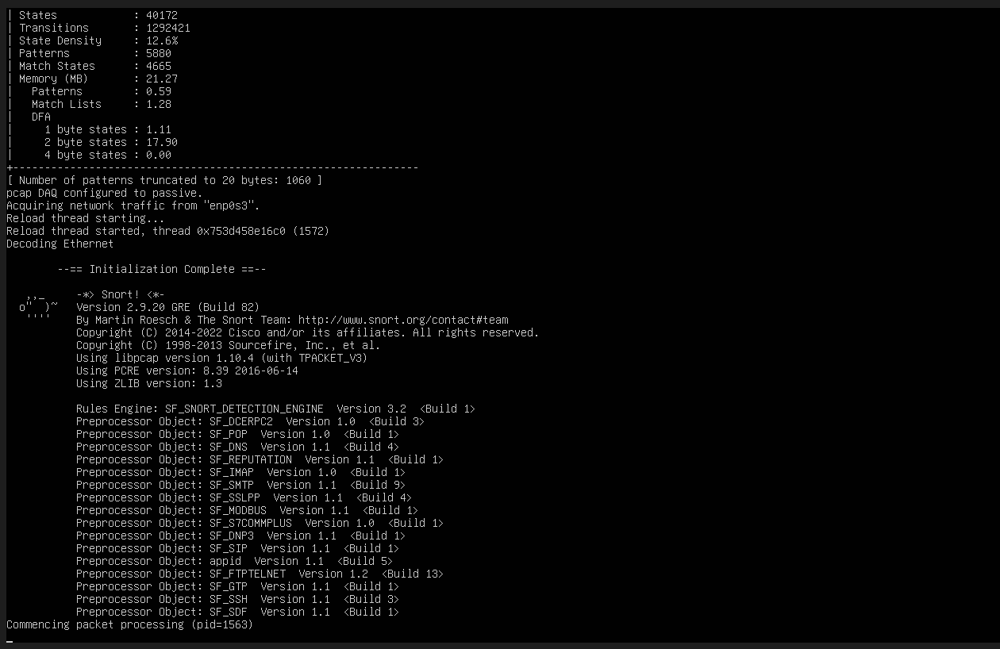

On the Windows side, Sysmon and the Splunk Universal Forwarder were configured to ship Security, System, Application, and Sysmon Operational event logs up to the SIEM:


---

## 3. Simulating the attack

With detection in place, an attack chain was run from the isolated Kali box, mapped to MITRE ATT&CK:

**Reconnaissance (TA0043 / T1595)** - an Nmap scan from Kali fingerprinted the domain controller and confirmed it as a Windows AD server (ports 88, 389, 445, 3268 open):

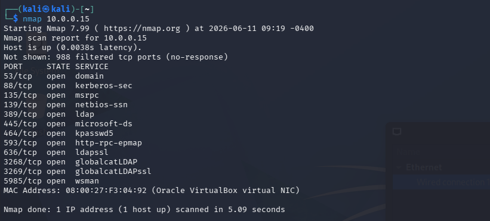

**Credential access (TA0006 / T1110.001)** - Hydra then brute-forced the local administrator account over SMB using a 100k-entry password wordlist, generating 3,000+ failed logon attempts:


```
hydra -l administrator -P ~/Downloads/100k-most-used-passwords-NCSC.txt smb2://10.0.0.15 -v
```

The passive Snort sensor caught the reconnaissance phase in real time, flagging both the routine ICMP sweep and the more specific Nmap ping signature:

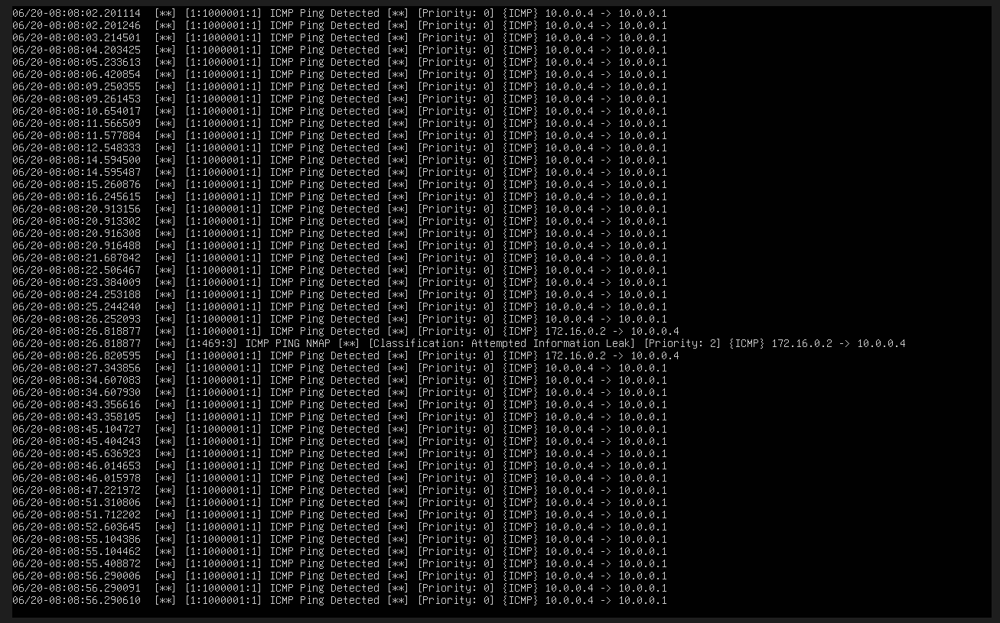

---

## 4. Detection & blocking

This is the core defensive control in the lab: **Suricata running inline on pfSense**, sitting between the attack segment and the LAN, with a custom high-priority rule written to catch the SMB brute-force pattern and drop it at the gateway - before it reaches the domain controller.

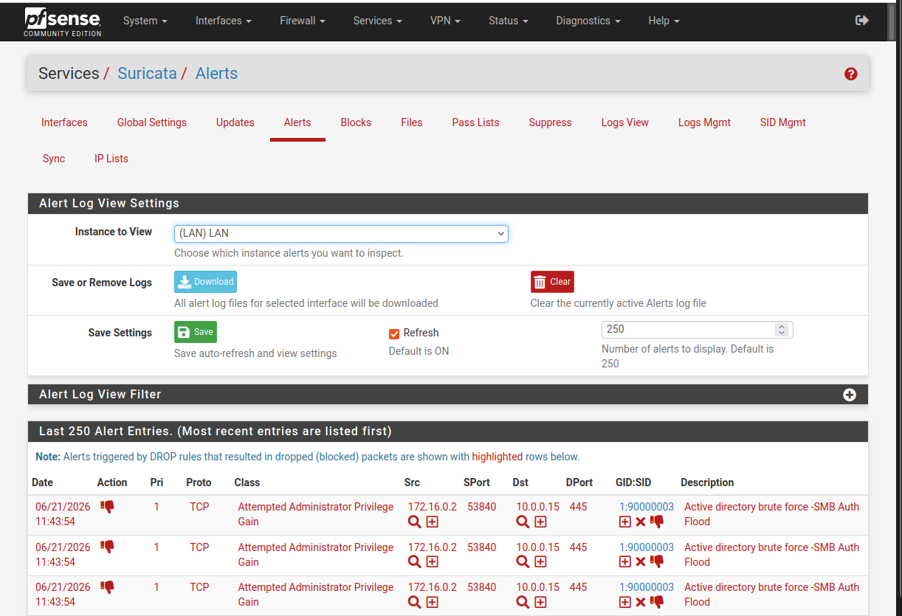

The repeated `Attempted Administrator Privilege Gain` / `Active directory brute force - SMB Auth Flood` alerts (GID:SID `1:90000003`) show the rule firing and dropping the offending packets from the Kali host (`172.16.0.2`) on every attempt, confirming the attack never reached `10.0.0.15` after the rule kicked in.

---

## 5. Analysis & alerting in Splunk

Suricata's EVE JSON logs are forwarded to Splunk over syslog (UDP 5140), where the brute-force attempt becomes searchable and reportable.

A simple SPL query against the failed SMB logon status confirms the volume of the attack as seen by the IPS:

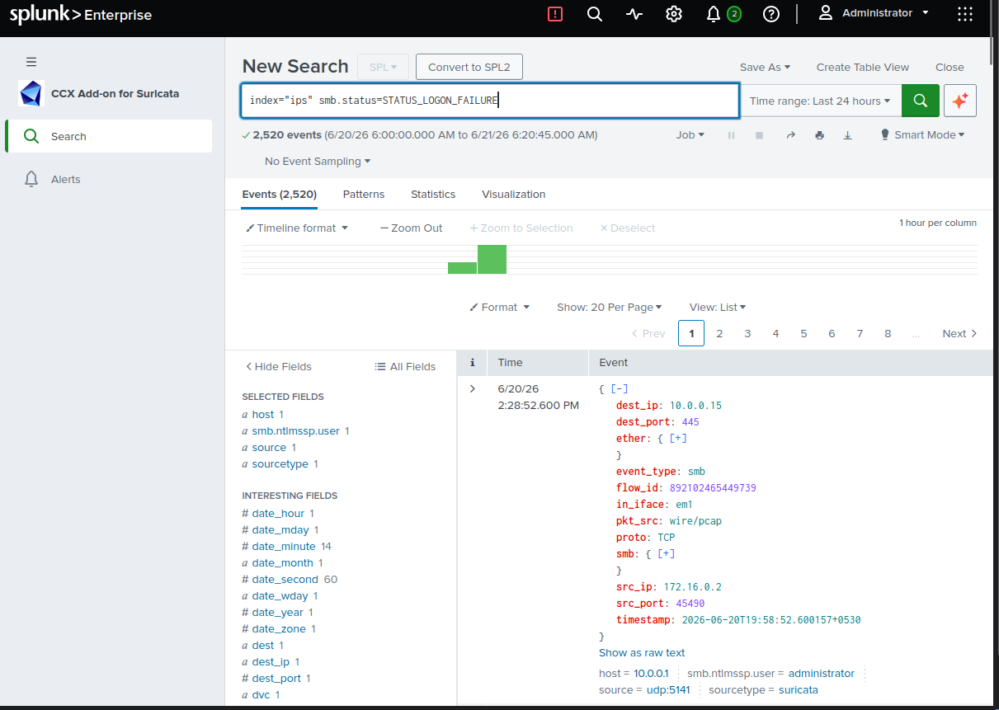

```spl
index="ips" smb.status=STATUS_LOGON_FAILURE
```

That was built into a dashboard aggregating failed logons by source IP and username - clearly isolating the attacking host and the targeted account:

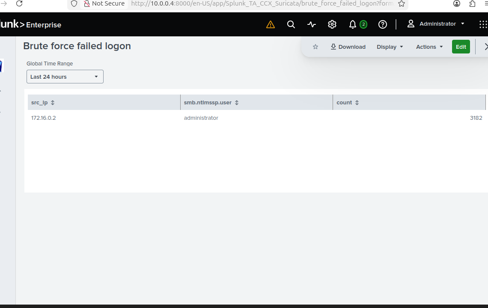

| src_ip | smb.ntlmssp.user | count |
|---|---|---|
| `172.16.0.2` | `administrator` | `3182` |

Finally, a scheduled Splunk alert runs hourly against this search and emails the analyst if any failed-logon events are found in the window - closing the loop from raw packet capture to an actionable notification:

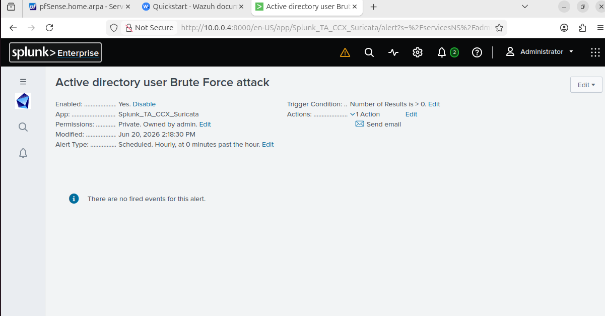

---

## Outcome

| Stage | Result |
|---|---|
| Recon | Detected by passive Snort IDS (ICMP + Nmap signatures) |
| Brute force | 3,182 failed SMB logon attempts generated against the DC |
| Inline defense | Suricata IPS on pfSense dropped the attack traffic at the gateway |
| SIEM visibility | Full attack ingested into Splunk via EVE JSON over syslog, searchable and dashboarded |
| Alerting | Hourly scheduled Splunk alert configured to notify on new brute-force activity |

The domain controller never had to absorb the brute-force traffic directly - it was stopped at the network boundary, with full visibility retained in the SIEM for investigation.

---

## Skills demonstrated

- Network segmentation and firewall policy design (pfSense)
- Active Directory deployment, OU design, and Kerberos authentication across Windows and Linux clients
- IDS/IPS rule writing and tuning (Snort, Suricata)
- Log pipeline design: Sysmon → Splunk Universal Forwarder, Suricata EVE JSON → syslog → Splunk
- SPL search development and dashboard/alert creation
- Attack simulation and MITRE ATT&CK mapping (Nmap, Hydra)
- End-to-end incident lifecycle: detect → block → investigate → alert

## Possible next steps

- Add CrowdSec community blocklists alongside the custom Suricata rule for broader coverage
- Build a correlation search that chains the Nmap recon alert and the SMB brute-force alert into a single incident
- Extend Sysmon-based detections on the Windows 10 client (e.g., credential dumping, lateral movement)
- Automate the attack simulation with a script for repeatable testing
